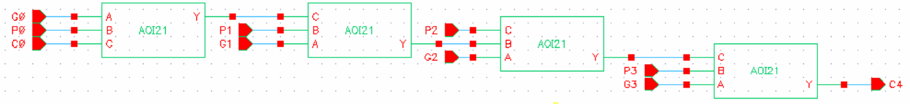
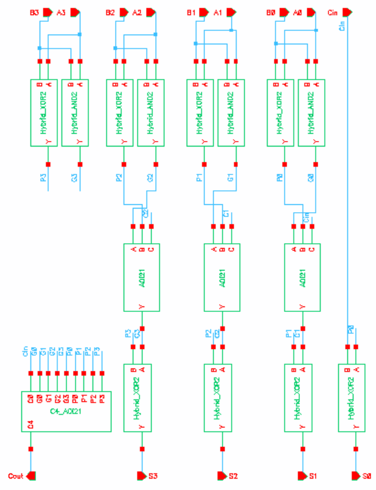
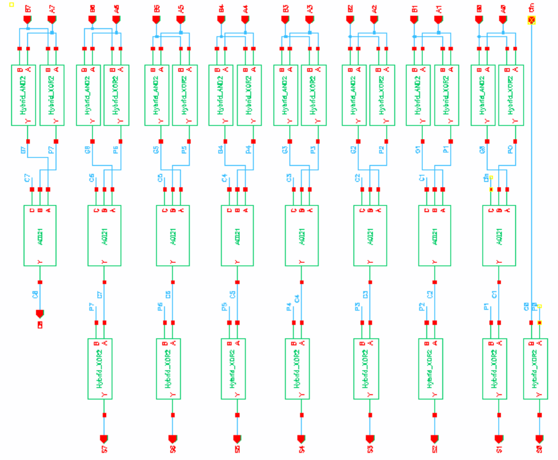
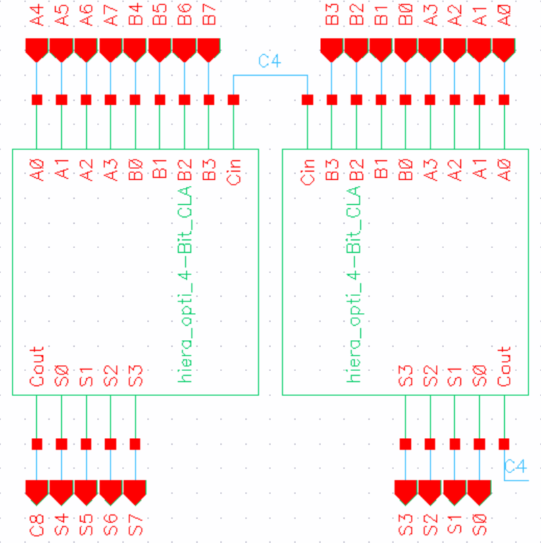
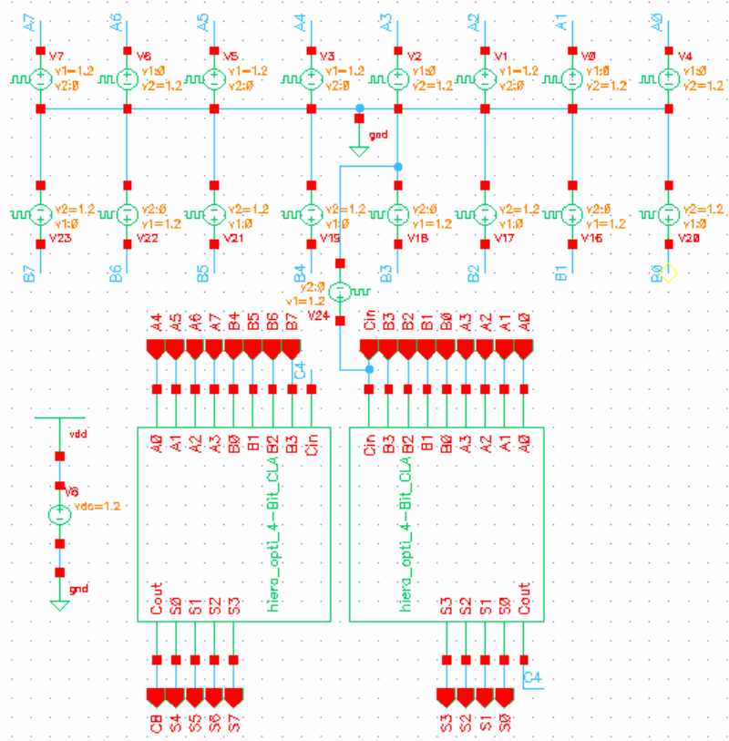
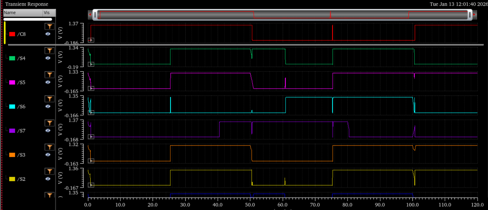
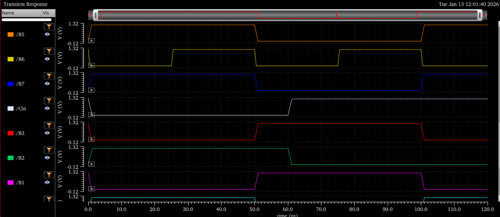
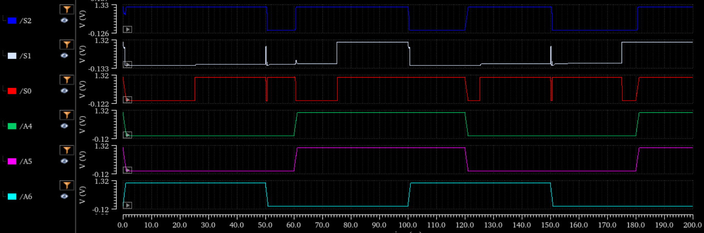
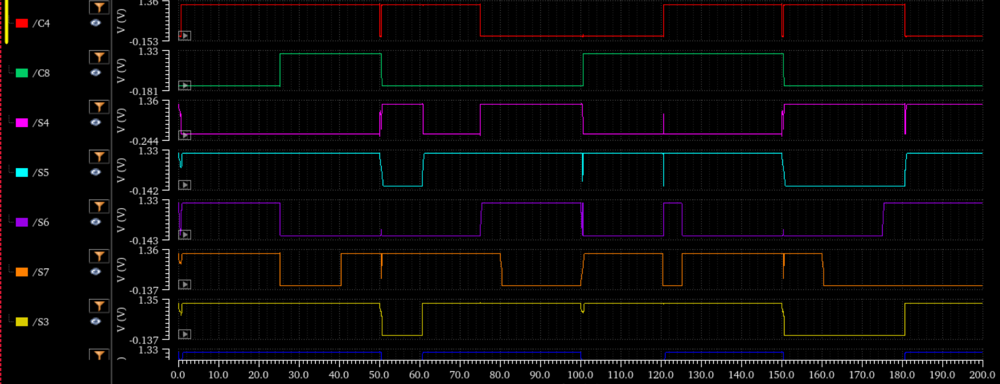

---

# 🔋 Low-Power 8-Bit Carry Look-Ahead Adder Using Hybrid AND–XOR Logic and Unified AOI21 Carry Computation

### Using Hybrid AND–XOR Logic and Unified AOI21-Based Carry Computation


---

## 📌 Overview

This repository presents the **design, implementation, and evaluation of an energy-efficient 8-bit Carry Look-Ahead Adder (CLA)** optimized at the **gate and transistor level** using **45-nm CMOS technology**.

The proposed design is based on:

* **Hybrid AND–XOR logic** for propagate and generate computation
* **Unified AOI21-only carry realization** for all carry equations
* **Optimized C4 true look-ahead carry computation**
* **Hierarchical 8-bit CLA construction using optimized 4-bit blocks**

All circuits are designed and simulated at the **transistor level in Cadence Virtuoso**.

---

## 🎯 Motivation

Conventional CLA designs reduce ripple carry delay but still suffer from:

* High power dissipation
* Large fan-in carry logic
* Excessive internal switching

Recent works focus on **architectural optimization**, while **gate-level logic restructuring of CLA blocks remains limited**.

This work focuses on:

* Reducing power through **hybrid logic styles**
* Reducing logic depth using **AOI21-based carry computation**
* Understanding **inter-block carry dominance** in cascaded CLAs
* Identifying why **hierarchical CLA outperforms flat CLA**

---

## 🧮 Logic Equations (GitHub-Safe)

```
Propagate:  Pi = Ai ⊕ Bi
Generate:   Gi = Ai · Bi
Sum:        Si = Pi ⊕ Ci

Carry:      C(n+1) = Gn + (Pn · Cn)
```

All carry equations are realized using **AOI21 logic gates**.

---

## 🔧 Gate-Level Implementations

### AOI21 Gate (Carry Computation)

Used uniformly for all carry equations.


---

### Hybrid AND Gate (Generate Logic)

Used to compute Gi with reduced switching activity.


---

### Hybrid XOR Gate (Propagate & Sum Logic)

Used for Pi and Si generation.


---

## 🧱 Optimized 4-Bit CLA Building Block

### Why Optimize C4?

In cascaded CLAs, **C4 dominates the critical path**.
Instead of computing C4 through sequential carry propagation, it is generated using **factored true look-ahead implemented only with AOI21**.

This approach showed **lower delay and power** compared to AND–OR based realizations.

### Optimized C4 Logic



---

### Optimized 4-Bit CLA Block



---

## 🔬 8-Bit CLA Implementations

### ❌ Direct Flat 8-Bit CLA (Baseline)

A fully flat 8-bit CLA was implemented using AOI21 and hybrid logic.



**Observation:**
Despite correct functionality, delay is high due to:

* Large fan-in carry logic
* Increased parasitic capacitance

---

### ✅ Proposed 8-Bit CLA (Cascaded Optimized 4-Bit Blocks)

Two optimized 4-bit CLAs are cascaded:

* Lower block computes C0–C3
* **C4 is generated independently using optimized AOI21 logic**
* Upper block starts operation as soon as C4 is available



---

## 📊 Performance Results (45-nm CMOS)

### 🔹 4-Bit CLA Comparison

| Design Variant              | Delay (ps) | Avg Power (µW) | PDP (fJ) | Transistors |
| --------------------------- | ---------- | -------------- | -------- | ----------- |
| Conventional CLA            | 63.03      | 41.68          | 2.63     | —           |
| Hybrid P/G + AOI21          | 77.49      | 11.13          | 0.86     | —           |
| **Optimized C4 (Proposed)** | **42.54**  | **16.94**      | **0.72** | **124**     |

---

### 🔹 8-Bit CLA Comparison (Final)

| Architecture              | Delay (ps) | Avg Power (µW) | PDP (fJ)  | Transistors |
| ------------------------- | ---------- | -------------- | --------- | ----------- |
| Flat 8-Bit CLA            | 160.8      | 44.49          | 7.16      | 200         |
| **Proposed Cascaded CLA** | **~77.5**  | **~46.4**      | **~3.59** | **248**     |

📌 **Key Insight:**
Even with optimized C4, **inter-block carry dominates**, validating the need for **hierarchical CLA design** rather than flat expansion.

---

## 🧮 Transistor Count Details

### Optimized 4-Bit CLA

| Gate Type  | Transistors | Instances | Total   |
| ---------- | ----------- | --------- | ------- |
| AOI21      | 8           | 7         | 56      |
| Hybrid AND | 5           | 4         | 20      |
| Hybrid XOR | 6           | 8         | 48      |
| **Total**  | —           | —         | **124** |

---

### Flat 8-Bit CLA

| Gate Type  | Transistors | Instances | Total   |
| ---------- | ----------- | --------- | ------- |
| AOI21      | 8           | 8         | 64      |
| Hybrid AND | 5           | 8         | 40      |
| Hybrid XOR | 6           | 16        | 96      |
| **Total**  | —           | —         | **200** |

---

## ⚡ Energy Metrics

```
PDP = Power × Delay
EDP = Power × (Delay)^2
```

These metrics are used for **fair energy-efficiency comparison**.

---

## 🧪 Simulation Setup

* Tool: Cadence Virtuoso
* Technology: 45-nm CMOS
* Supply Voltage: 1.2 V
* Simulation Type: Transistor-level (post-schematic)
* Critical Path: Cin → Cout

📂 **testbench & Waveforms:**



---



---



---



---



---

## 🔍 Limitations & Future Work

* No post-layout PEX performed
* Area estimated using transistor count
* Future extensions:

  * Hierarchical block-level CLA
  * Voltage scaling analysis
  * Corner & Monte-Carlo simulations
  * Integration with NCLA / prefix adders

---

## 📚 Intended Use

* VLSI research & education
* Low-power arithmetic design
* CLA building-block optimization

---

## ⭐ If this work helps your research, please consider starring the repository.

---


