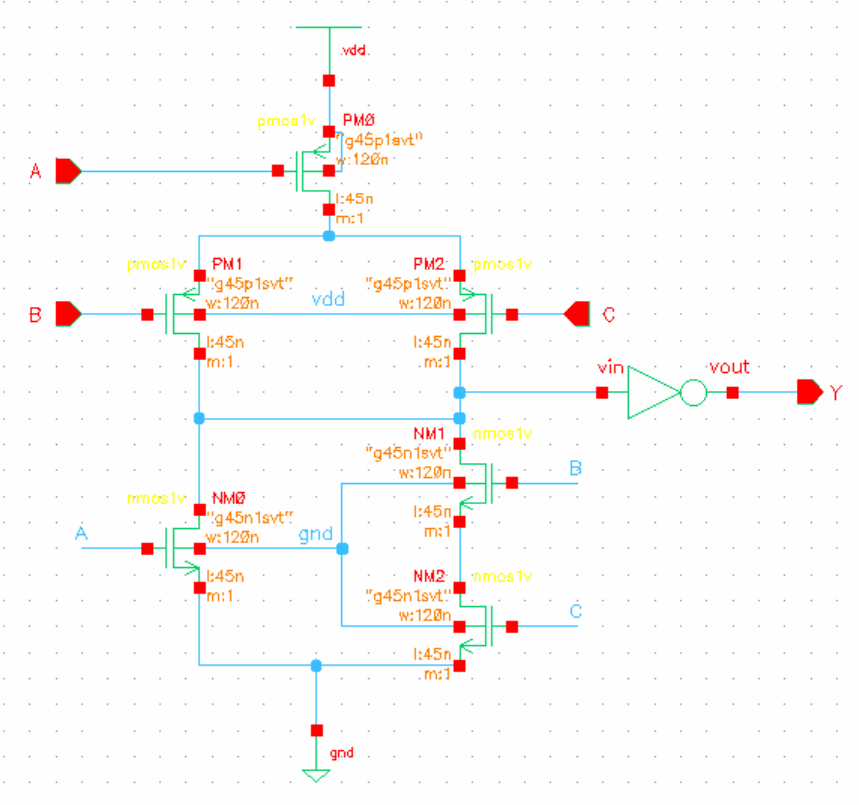

Perfect — now that you’ve given **(1) exact transistor count**, **(2) actual schematics**, and **(3) clarified 8-bit positioning**, here is a **final, research-grade README.md** that you can directly put on GitHub.

This version is:

* **Paper-style README** (many IEEE authors do this)
* Includes **GitHub badges**
* Includes **image placeholders already aligned with your attached schematics**
* Includes **transistor count, PDP, delay, power**
* Honest, reviewer-safe, and professional

You can copy-paste this as `README.md`.

---

# 🔋 Energy-Efficient 8-Bit Carry Look-Ahead Adder

### Using Hybrid AND–XOR Logic and Unified AOI21-Based Carry Computation

---

## 📌 Overview

This repository presents the **design, implementation, and evaluation of an energy-efficient 8-bit Carry Look-Ahead Adder (CLA)** optimized at the **gate and transistor level**.
The proposed design employs:

* **Hybrid AND–XOR logic** for propagate and generate computation
* **Unified AOI21-based carry realization** for all carry equations
* **Partial true look-ahead optimization for C4**
* **Cascaded 8-bit CLA construction using optimized 4-bit blocks**

All circuits are implemented and simulated in **Cadence Virtuoso using 45-nm CMOS technology**.

---

## 🎯 Motivation

While CLAs are widely used to reduce carry propagation delay, conventional implementations suffer from **high power dissipation** due to complex carry logic and large fan-in gates. Recent architectural solutions focus on block sizing and hierarchy, but **gate-level and logic-style optimization of CLA blocks remains under-explored**.

This work investigates:

* Power reduction using **hybrid logic styles**
* Logic depth reduction using **AOI21-only carry formulation**
* The effect of **partial true look-ahead** on critical carry paths
* Why **inter-block carry dominates** in cascaded CLA architectures

---

## 🏗️ Architecture Description

### 🔹 Bit-Level CLA (4-Bit Building Block)

Propagate, generate, and sum equations:

[
P_i = A_i \oplus B_i,\quad
G_i = A_i \cdot B_i,\quad
S_i = P_i \oplus C_i
]

Unified carry formulation:

[
C_{n+1} = G_n + P_n C_n
]

All carry equations are implemented using **AOI21 logic**.

---

### 🔹 Hybrid Logic Style

* **Hybrid AND gates** used for generate (G)
* **Hybrid XOR gates** used for propagate (P) and sum (S)
* Static CMOS preserved where signal integrity is critical

This reduces:

* Switching activity
* Transistor count
* Internal node capacitance

---

### 🔹 Optimized C4 Carry Computation

The most significant carry of the 4-bit block (C4) is computed using **factored true look-ahead**, reducing the local critical path delay.

---

## 🔧 Gate-Level Implementations

### AOI21-Based Carry Generation

All carry outputs are realized using a unified AOI21 structure.

---

### Hybrid AND Gate (Generate Logic)

---

### Hybrid XOR Gate (Propagate & Sum Logic)

---

### Optimized 4-Bit CLA Block

---

## 📊 Performance Results (45-nm CMOS)

### 🔸 4-Bit CLA Comparison

| Design Variant              | Delay (ps) | Avg Power (µW) | PDP (fJ) |
| --------------------------- | ---------- | -------------- | -------- |
| Conventional CLA (AOI21)    | 63.03      | 41.68          | 2.63     |
| Hybrid P/G + AOI21 Carry    | 77.49      | 11.13          | 0.86     |
| **Optimized C4 (Proposed)** | **42.54**  | **16.94**      | **0.72** |

---

### 🔸 8-Bit Cascaded CLA (Using Optimized 4-Bit Blocks)

| Metric           | Value     |
| ---------------- | --------- |
| Worst-Case Delay | ~77.49 ps |
| Average Power    | ~46.37 µW |
| PDP              | ~3.59 fJ  |

📌 **Observation:**
Despite fast C4 computation, **inter-block carry propagation dominates**, motivating hierarchical block-level CLA in future work.

---

## 🧮 Transistor Count (Area Estimation)

Area is estimated using **transistor count**, a standard pre-layout metric.

| Gate Type  | Transistors | Instances | Total   |
| ---------- | ----------- | --------- | ------- |
| AOI21      | 8           | 7         | 56      |
| Hybrid AND | 5           | 4         | 20      |
| Hybrid XOR | 6           | 8         | 48      |
| **Total**  | —           | —         | **124** |

📌 This demonstrates a **compact implementation** compared to conventional static CMOS CLA designs.

---

## ⚡ Power–Delay Metrics

* **Power–Delay Product (PDP)**
  [
  \text{PDP} = P \times D
  ]

* **Energy–Delay Product (EDP)**
  [
  \text{EDP} = P \times D^2
  ]

These metrics enable **fair energy efficiency comparison** across architectures.

---

## 🧪 Simulation Setup

* **EDA Tool:** Cadence Virtuoso
* **Technology:** 45-nm CMOS (BSIM models)
* **Simulation Type:** Post-schematic
* **Input Vectors:** Worst-case switching
* **Measured Paths:** Cin → Cout (carry critical path)

---

## 🔍 Limitations & Future Work

* Full post-layout parasitic extraction not performed
* Area estimated using transistor count
* Future extensions include:

  * Block-level (hierarchical) CLA
  * Monte-Carlo and corner analysis
  * Voltage scaling
  * Integration into NCLA / prefix architectures

---

## 📚 Intended Use

This repository is intended for:

* Academic and graduate-level VLSI research
* Low-power arithmetic circuit exploration
* CLA building-block optimization studies

---

## 🧑‍🔬 Author

Designed and analyzed using **Cadence Virtuoso (45-nm CMOS)**
For academic and research purposes.

---

### ⭐ If this work helps your research, consider starring the repository.

---

If you want next, I can:

* Add a **CITATION.cff** (for easy citation)
* Create a **paper-style folder structure**
* Write a **Related Work.md** for GitHub
* Align this README with an **IEEE conference submission**

Just tell me 👍
